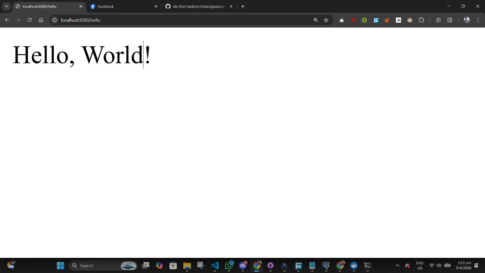
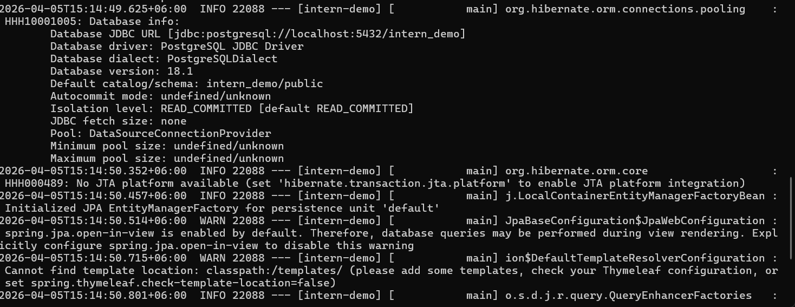
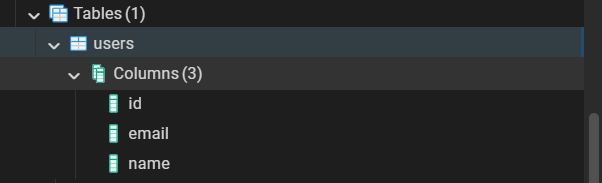

# Intern Demo

A simple Spring Boot application demonstrating basic REST API endpoints, JPA entities, and local PostgreSQL integration.

## Prerequisites
- **Java 26** (or your installed JDK version compatible with the project)
- **PostgreSQL** running locally on port `5432`

## Database Setup
1. Open your PostgreSQL terminal (`psql`) or pgAdmin.
2. Create a new database named `intern_demo`.
3. The application is configured to connect using the username `postgres` and password `postgres`. If your credentials differ, update them in `src/main/resources/application.properties`.

## Running the Application

This project uses the Maven Wrapper, so you don't need Maven installed on your machine.
Open your terminal in the root directory of the project and execute:

```powershell
.\mvnw.cmd spring-boot:run
```

Because the application uses `spring.jpa.hibernate.ddl-auto=update`, the `users` table will be automatically generated upon a successful launch.

## Endpoints

### 1. Hello World
- **URL**: `/hello`
- **Method**: `GET`
- **Response**: `"Hello, World!"`


